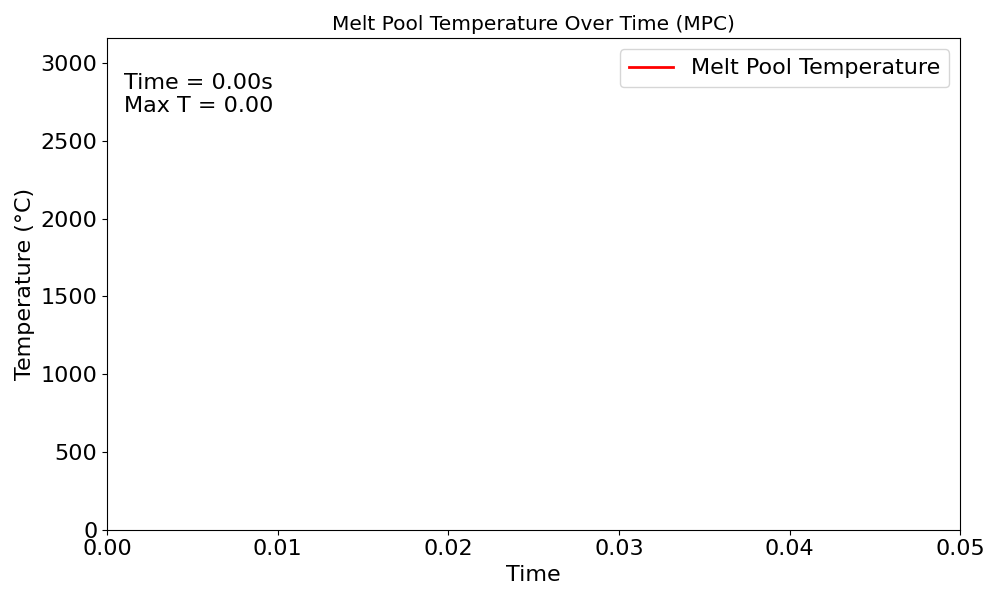
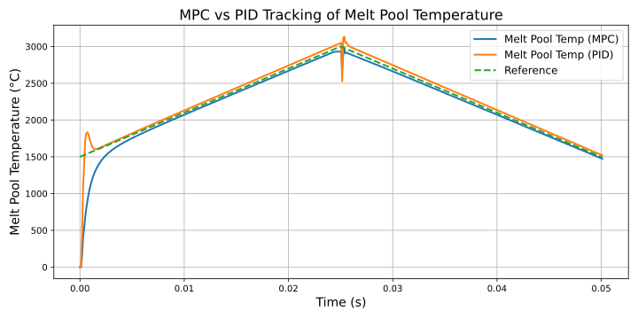
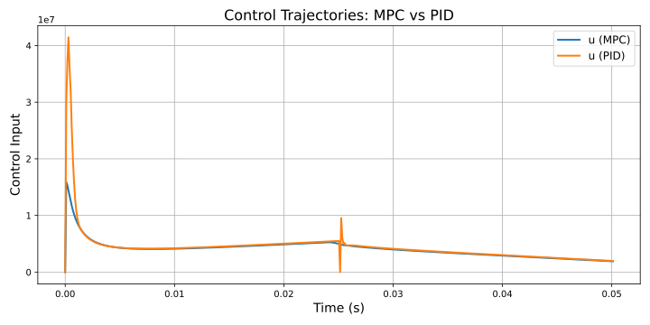
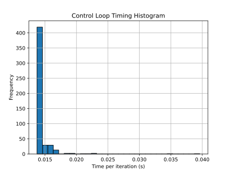

# Laser Powder Bed Fusion 1D MPC

Physics-based model predictive control (MPC) for Laser Powder Bed Fusion using a 1D forward-difference thermal model. The controller adjusts laser power to track melt pool temperature under a moving heat source.

---

## Overview

This project builds a control-oriented thermal model for LPBF, progressing from first-principles simulation to closed-loop control.

The workflow starts with solving the heat conduction equation, then introduces a moving laser source, and ultimately applies MPC to regulate melt pool temperature. A PID controller is included as a baseline.

---

## Methodology

Development progressed through:

1. Solve 1D heat conduction PDE using a forward-difference method  
2. Control maximum temperature with a stationary laser  
3. Extend to a moving laser source  
4. Control melt pool temperature at the laser location  
5. Discretize laser power to reflect real actuation constraints  
6. Transition toward reduced-order modeling (TAPSO)  

---

## Governing Model

The temperature field is modeled using a 1D heat equation:

du/dt = α d²u/dx² + Q(x,t)

The laser input is a moving Gaussian heat source:

Q(x,t) = P * exp(-2 (x - v t)^2 / r^2)

where:
- P is laser power  
- v is scan speed  
- r is beam width  

The PDE is solved using a forward-difference scheme. Melt pool temperature is sampled at the laser position x = v t.

---

## Control Formulation

At each time step, MPC selects laser power to track a desired temperature trajectory.

The objective minimizes:

J = sum over horizon of:
    Q * (x - x_ref)^2
  + α * (terminal error)^2
  + R * u^2
  + S * (u - u_prev)^2

where:
- x is predicted melt pool temperature  
- x_ref is the reference trajectory  
- u is laser power  
- Q, R, S weight tracking error, effort, and smoothness  

A PID controller is implemented for comparison.

---

## Results

### Melt Pool Temperature Tracking

### Control Input

### Loop Timing

---

## Code Structure

- src/mainFDNonLinearMPCMovingTrackingDiscretePower.py  
  Primary forward-difference MPC implementation  

- src/main_tapso_control.py  
  Early integration of reduced-order (TAPSO) modeling  

- src/mainFD*.py  
  Progressive model and control development  

- notebooks/  
  Exploratory simulations  

- figures/  
  Results and visualizations  

---

## Run

pip install -r requirements.txt  
python src/mainFDNonLinearMPCMovingTrackingDiscretePower.py  

---

## Current Limitations

- 1D model does not capture full melt pool physics  
- MPC is computationally expensive due to full PDE simulation  
- Performance degrades under fast transients  

---

## Future Work

Replace the forward-difference model with a tensor-decomposition-based reduced-order model (TAPSO).

Goals:
- Reduce computation time  
- Enable longer MPC horizons  
- Move toward real-time control on hardware  
